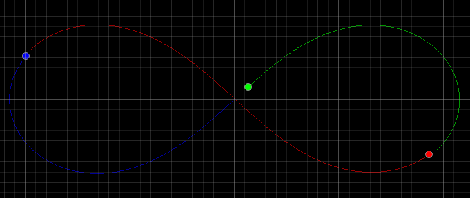

# n-body-sim



An N-body gravitational simulator written in Rust. This project simulates the gravitational interactions between multiple celestial bodies using numerical integration methods. The core physics engine is written in Rust for performance, and the configuration and visualization GUI tools are written in Python using Qt bindings.

## Quick Start (GUI)
### Prerequisites
- Python installed

### Windows
1. Download and extract the Windows release zip
2. Run `install.bat` to setup the  virtual environment and install required packages (first time only)
3. Run `run.bat` to launch the application

### Linux/macOS
1. Download and extract the Linux release tarball
2. Run `install.sh` to setup the virtual environment and install required packages (first time only)
3. Run `run.sh` to launch the application

## CLI Usage
The Rust physics engine can be run independently without installing Python or using the GUI tools.

### Command Line Options
- `-i, --initial-conditions-path <INITIAL_CONDITIONS_PATH>`: Path to initial conditions file
- `-o, --output-data-path <OUTPUT_DATA_PATH>`: Path to output trajectory data file
- `-g, --g-constant <G_CONSTANT>`: The gravitational constant to use in gravitational force calculations
- `-t, --time-step <TIME_STEP>`: Simulation time step in seconds
- `-n, --num-steps <NUM_STEPS>`: Number of time steps to simulate
- `--softening-factor <SOFTENING_FACTOR>`: The softening factor to avoid numerical instability as distances approach zero
- `--theta <THETA>`: Theta value for Barnes-Hut gravity calculation method
- `--gravity <GRAVITY>`: Gravity calculation method: `newton` (more to be added)
- `--integrator <INTEGRATOR>`: Integration method: `euler` (more to be added)
- `-h, --help`: Print help

### Examples

**Windows:**
```
.\n-body-sim.exe -i data/initial-conditions-examples/ic-figure-eight.csv -o data/output.csv --time-step 0.01 --num-steps 10000 --integrator euler
```

**Linux/macOS:**
```
./n-body-sim -i data/initial-conditions-examples/ic-figure-eight.csv -o data/output.csv --time-step 0.01 --num-steps 10000 --integrator euler
```

## Data Formats

### Initial Conditions Format
Initial conditions are provided as a CSV file with each row corresponding to a body:
| Column  | Type  | Description        |
| ------- | ----- | ------------------ |
| `mass`  | float | Body mass      |
| `pos_x` | float | Initial x-position |
| `pos_y` | float | Initial y-position |
| `vel_x` | float | Initial x-velocity |
| `vel_y` | float | Initial y-velocity |

**Example**
```csv
mass,pos_x,pos_y,vel_x,vel_y
1,-0.97000436,0.24308753,0.466203685,0.43236573
1,0.97000436,-0.24308753,0.466203685,0.43236573
1,0,0,-0.93240737,-0.86473146
```

### Output Format
Output is provided as a CSV file with time series data for all bodies:
| Column | Type  | Description           |
| ------ | ----- | ----------------------|
| `time` | float | Simulation time step  |
| `id`   | int   | Body identifier       |
| `x`    | float | Current x-position    |
| `y`    | float | Current y-position    |

The body ID matches the order of the bodies in the initial conditions, so the first body is ID 0, the second is ID 1, and so on.

**Example**
```csv
time,id,x,y
0.0,0,-0.97000436,0.24308753
0.0,1,0.97000436,-0.24308753
0.0,2,0.0,0.0
0.01,0,-0.9652210764707752,0.24738080232753093
0.01,1,0.9745451501707751,-0.23873348772753092
0.01,2,-0.0093240737,-0.0086473146
...
```

## Build

### Using the VS Code Dev Containers extension
1. In VS Code, install the "Dev Containers" extension and then open this project
2. Launch the development container by following by selecting the `Reopen in Container` option in the Dev Containers notification, or use the `>Dev Containers: Rebuild and Reopen in Container` command in the command palette.
3. Run `cargo build` in the VS Code terminal

### Manually with Docker installed
1. Build the development image with `docker build -t n-body-sim .`
2. Run the development container with `docker run -dit -v $(pwd):/home/dev/n-body-sim --name n-body-sim n-body-sim`
3. Enter the container with `docker exec -it n-body-sim bash`
4. In the container, run `cargo build`
