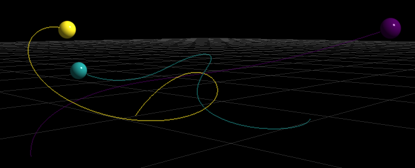
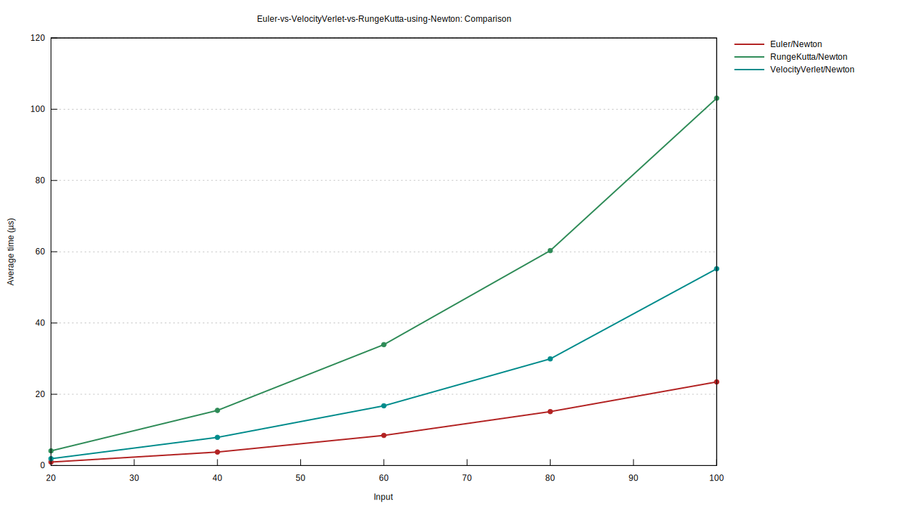
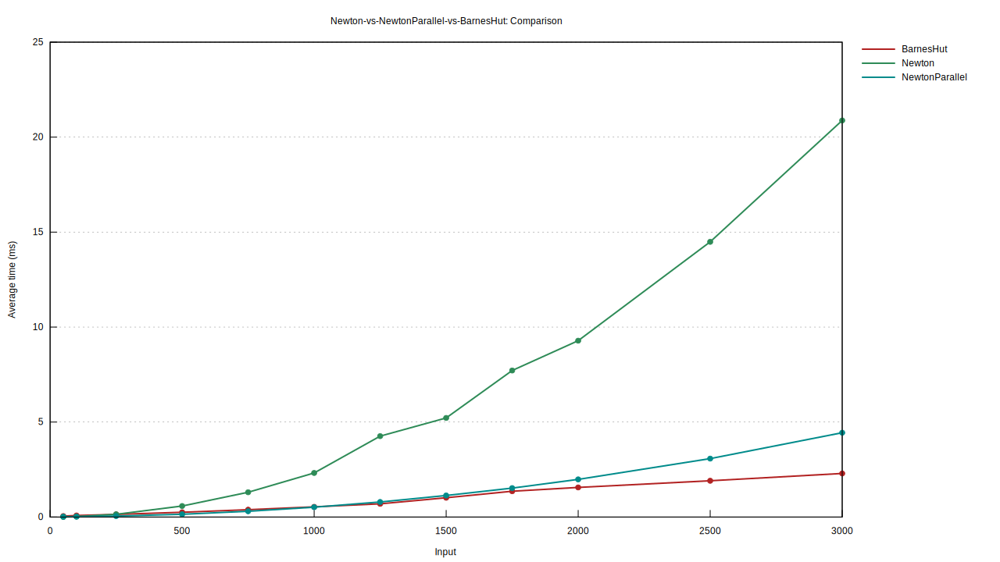
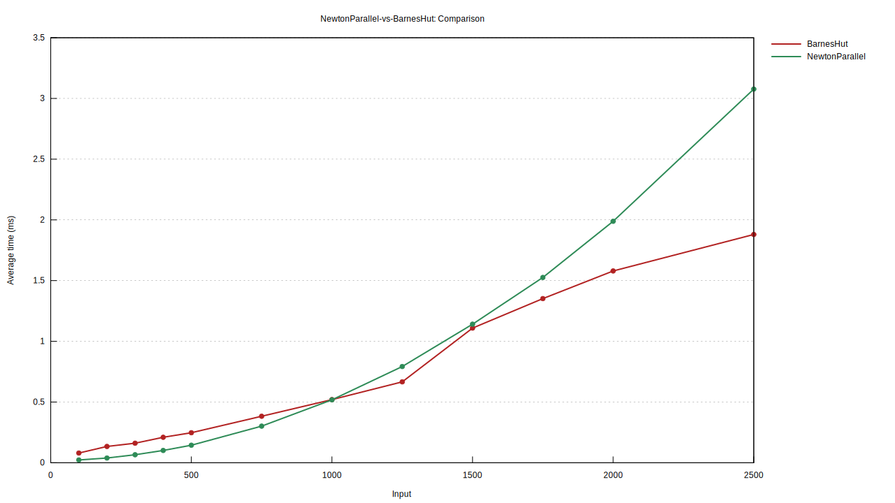
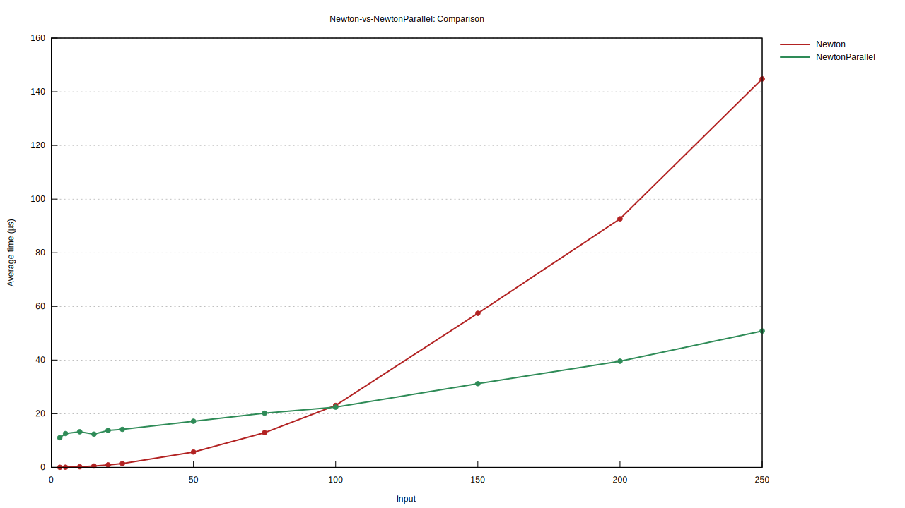
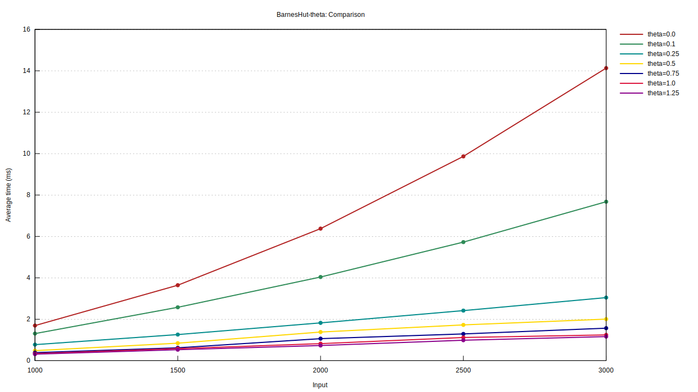
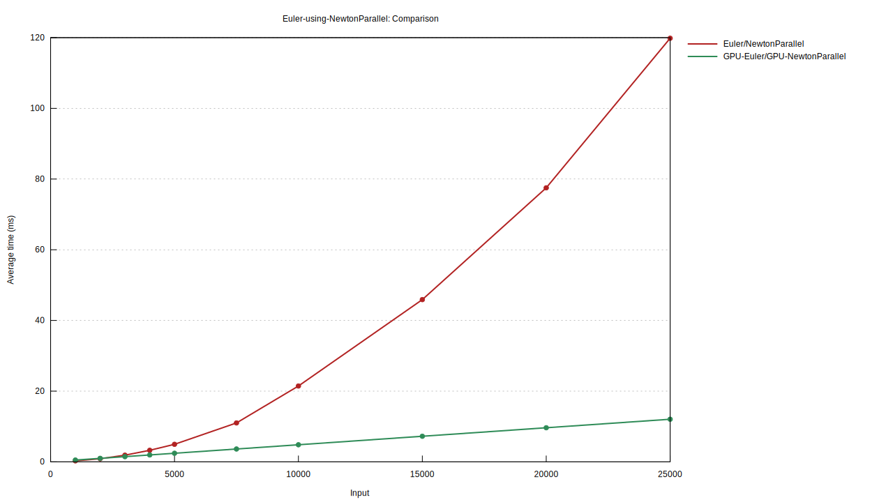
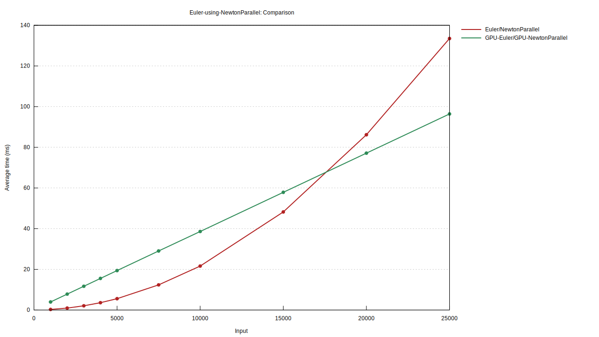

# n-body-sim
A simulator for how multiple objects in space (bodies) move and interact with each other through gravity.



## Overview
This project implements an N-body simulator that models the gravitational interactions between bodies in 3D using various numerical integration methods and algorithms. The physics engine is written in Rust, and the GUI is implemented in Python using the Qt framework and VisPy.

### Sections
- [Quick Start](#quick-start)
- [GUI Usage](#gui-usage)
  - [Launcher](#launcher)
  - [Visualizer](#visualizer)
- [CLI Usage](#cli-usage)
- [Data Formats](#data-formats)
  - [Initial Conditions](#initial-conditions)
  - [Output Data](#output-data)
- [Build](#build)
- [Theory](#theory)
    - [Integrators](#integrators)
    - [Gravity](#gravity)
- [Benchmarks](#benchmarks)
    - [Integrators](#integrators)
    - [Gravity](#gravity)
    - [GPU Acceleration](#gpu-acceleration)
- [Design](#design)

## Quick Start
### Prerequisites
- Python 3.11+ installed
- (optional) NVIDIA GPU with CUDA 12.0+ support (already included in modern drivers) to use GPU acceleration

### Windows Setup
TBD

### Linux Setup
1. Clone the repository and follow the [Build](#build) instructions (prebuilt release TBD)
2. Run `install.sh` to setup the Python virtual environment and install required packages (first time only)
    - On Debian/Ubuntu, you may need to install `python3-venv` with `sudo apt install python3-venv` before running this install script
3. Run `run.sh` to start the application

### Run an Example Simulation
1. Start the application using the instructions above
2. Click "Load Scenario" and select an example initial conditions file (e.g. `data/examples/figure-eight/initial_conditions.csv`)
3. Click "Launch and View Simulation" to run the simulation and see the results.
4. In the visualizer window, press the "Play" button in the bottom left to start the simulation playback.
5. Use the WASD, QE, and FC keys to move and left-click mouse-drag to look around
6. You can close the visualizer window at any time and go back to the launcher to load a different configuration or run a new simulation. The launcher stays open while the visualizer is running, so you can launch multiple simulations and have multiple visualizer windows open at the same time.

### Generate a Random Simulation
1. Start the application using the instructions above
2. Under the "Generate Scenario" section, select a generator type (e.g. "Star System"), number of bodies `n` (e.g. 100), and radius `r` (e.g. 10.0), then click "Generate Scenario" to create a random initial conditions configuration
3. Click "Launch and View Simulation" to run the simulation and see the results.  
**Note:** disable the "Enable Trails" option in the visualization configuration for better performance when viewing 100+ bodies, as rendering trails for many bodies can cause lag during playback.

See the [GUI Usage](#gui-usage) and [CLI Usage](#cli-usage) sections below for more details on how to use the application.

## GUI Usage

### Launcher
The launcher allows you to configure simulation parameters and body initial conditions:
- **Simulation Parameters**: Set the various simulation parameters:
  - Gravitational constant 
  - Time step
  - Number of steps
  - Softening factor
  - Theta (for Barnes-Hut)
  - Gravity calculation method (if $N$ is the number of bodies in the simulation, it is recommended to use `newton` for $N\lt 100$, `newton-parallel` for $100 \leq N\lt 500$, and `barnes_hut` for $N\geq 500$.)
  - Integration method (the `runge-kutta` integrator takes the longest to compute, `velocity-verlet` is approximately twice as fast as `runge-kutta`, and `euler` is approximately twice as fast as `velocity-verlet`, so 4x faster than `runge-kutta`, but is the least accurate of the three)
- **Visualization Configuration**: Configure visualization and graphics settings
  - Camera mode (fly or turntable)
  - Step rate (playback speed in steps/second)
  - Default radius of bodies in visualization
  - Trail window size (length in previous time steps of trails behind each body)
  - Enable trails showing the recent path of each body ***(recommend disabling when viewing simulations with 100+ bodies to avoid lag during playback)***
  - Enable legend
  - Enable spherical visual effect for bodies (when disabled, bodies are rendered as flat colored circles)
- **Body Table**: Add, remove, and edit body properties (name, color, radius, mass, position, velocity)
- **Load/Save Scenario**: Load existing launcher configurations or save your current one
- **Generate Scenario**: Generate a random N-body system based on the selected generator (e.g. Star System), number of bodies (n) and radius (r).
- **Launch and View Simulation**: Start the physics simulation with your configured parameters and automatically display the visualization when complete
- **Launch Simulation**: Run the physics simulation without displaying the visualization. Prompts you to select a directory to save the results
- **View Simulation**: Load and display the visualization of previously saved simulation results from a selected directory

**Note:** The launcher expects these specific file names in selected directories when loading or saving configurations and simulation data:
- `initial_conditions.csv` for body initial conditions
- `config.json` for launcher configuration
- `output.csv` or `output.nbody` for simulation output data

When using the "Launch and View Simulation" option, the launcher automatically saves the initial conditions (`initial_conditions.csv`), the configuration (`config.json`), and the output data (`output.csv` or `output.nbody`) files to the directory `data/run/run_<timestamp>`. Otherwise, when using the individual "Launch Simulation" or "View Simulation" options, you will be prompted to select a directory to save or load these files, respectively.

### Visualizer

#### **Camera Navigation**
The visualizer supports two camera modes:

**Fly Mode** (free-flying camera):
- **Look**: Left-click and drag to look around
- **Movement**: Use WASD to move around, Q and E to roll, and F and C to move up and down
- **Zoom**: Scroll wheel to zoom in/out

**Turntable Mode** (orbit around center):
- **Rotate**: Left-click and drag to orbit around the center
- **Translate**: Shift-left-click and drag to translate the camera
- **Zoom**: Scroll wheel to zoom in/out

#### **Playback Controls**
- **Play/Pause**: Click the "Play" button to start/stop the simulation playback
- **Timeline**: Click and drag on the slider or click at any point to jump to a specific time step in the simulation

## CLI Usage
The Rust physics engine executable can also be run independently without installing Python or using the GUI tools.

### Command Line Options

**General Usage**
- `-i, --initial-conditions-path`: Path to a CSV file containing the initial conditions for each body in the simulation. Each row should represent a body with its mass, initial position, and initial velocity. Default: `initial_conditions.csv`
- `-o, --output-data-path`: Path to a csv or nbody file where the simulation output data will be saved. Default: `output.csv`
- `-g, --g-constant`: The gravitational constant to use in the gravitational force calculations. This is a scaling factor that affects the strength of the gravitational interactions between bodies. Default: `1.0`
- `-t, --time-step`: The time step in seconds for the simulation. This determines how frequently the positions and velocities of the bodies are updated. A smaller time step can lead to more accurate results but will increase the computation time. Default: `0.01`
- `-n, --num-steps`: The total number of time steps to simulate. This determines the overall duration of the simulation. For example, with a time step of 0.01 seconds and 10000 steps, the simulation will cover a total of 100 seconds of simulated time. Default: `10000`
- `--softening-factor`: The softening factor is used to prevent numerical instability when two bodies come very close to each other. It is added to the distance between bodies in the force calculation to ensure that the force does not become infinite. A larger softening factor increases numerical stability but reduces physical accuracy at short distances, while a smaller softening factor provides higher physical accuracy but increases the risk of instability during close encounters. Default: `0.005`
- `--theta`: The theta value is used in the Barnes-Hut gravity calculation method to determine when to approximate a group of distant bodies as a single combined mass. A smaller theta value results in a more accurate simulation but increases computation time, while a larger theta value reduces accuracy but improves performance. Default: `0.5`
- `--gravity`: The method to use for calculating gravitational forces between bodies. The options are `newton`, `newton-parallel`, and `barnes-hut`. Default: `newton`
- `--integrator`: The numerical integration method to use for updating the positions and velocities of the bodies at each time step. The options are `euler`, `velocity-verlet`, and `runge-kutta`. Default: `euler`
- `--gpu`: Enable GPU acceleration for the simulation using CUDA. This can significantly improve performance for large simulations, but requires an NVIDIA GPU with CUDA support. Currently only supports the `newton-parallel` gravity method and `euler` integrator. Default: disabled
- `-h --help`: Displays the help message with all available command line options

### Examples

**Windows:**
```
bin\n-body-sim.exe -i data/examples/figure-eight/initial_conditions.csv -o data/output.csv --time-step 0.01 --num-steps 10000 --integrator velocity-verlet
```

**Linux:**
```
bin/n-body-sim -i data/examples/figure-eight/initial_conditions.csv -o data/output.csv --time-step 0.01 --num-steps 10000 --integrator velocity-verlet
```

## Data Formats

### Initial Conditions
Initial conditions are provided as a CSV file with each row corresponding to a body:
| Column  | Type  | Description        |
| ------- | ----- | ------------------ |
| `mass`  | float | Body mass          |
| `pos_x` | float | Initial x-position |
| `pos_y` | float | Initial y-position |
| `pos_z` | float | Initial z-position |
| `vel_x` | float | Initial x-velocity |
| `vel_y` | float | Initial y-velocity |
| `vel_z` | float | Initial z-velocity |

**Example**
```csv
mass,pos_x,pos_y,pos_z,vel_x,vel_y,vel_z
1,0,0,0,0,0,0
3.003e-6,1,0,0,0,1,0
3.694e-8,1.00257,0,0,0,1.0342,0
```

### Output Data

#### **CSV**

Output can be saved to a CSV file with time series data for all bodies:
| Column | Type  | Description           |
| ------ | ----- | ----------------------|
| `time` | float | Timestamp             |
| `id`   | int   | Body identifier       |
| `x`    | float | Current x-position    |
| `y`    | float | Current y-position    |
| `z`    | float | Current z-position    |

The body ID matches the order of the bodies in the initial conditions, so the first body is ID 0, the second is ID 1, and so on.

**Example**
```csv
time,id,x,y,z
0.0,0,-1.0,0.0,0.0
0.0,1,1.0,0.2,0.0
0.0,2,0.0,1.0,-0.2
0.01,0,-0.9999410506357825,0.005036782899891881,0.0019931360081177473
0.01,1,0.9969294480041954,0.1950342751323182,-9.184518199699633e-6
0.01,2,0.002011602631587234,0.9999289419677899,-0.19498395148991807
...
```

#### **Binary**

For more efficient file sizes, especially for large simulations, output can be saved to a binary file format:

| **Field** | **Type** | **Size (Bytes)** | **Description**                             |
| --------- | -------- | ---------------- | --------------------------------------------|
| `time`    | `f64`    | 8                | Timestamp                                   |
| `id`      | `u64`    | 8                | Body identifier                             |
| `x`       | `f64`    | 8                | The x-coordinate of the body's position.    |
| `y`       | `f64`    | 8                | The y-coordinate of the body's position.    |
| `z`       | `f64`    | 8                | The z-coordinate of the body's position.    |

The file extension for binary output data files is `.nbody` and the file begins with an 8-byte magic number: `0x4E424F4459303031` (ASCII `NBODY001`). Each record consists of the five 64-bit (little-endian 8-byte) fields: time, id, and the x, y, z coordinates of the body's position at that time step, for a total of 40 bytes per record.
```
[0x4E424F4459303031][time][id][x][y][z][time][id][x][y][z]...
```

## Build

### Container Setup
#### **Using Dev Containers**
1. Launch the project in a dev container from your code editor using the configuration in `.devcontainer/devcontainer.json`

#### **Manually with Docker installed**
1. Build the development image with `docker build -t n-body-sim .`
2. Run the development container with 
    - Linux (bash): `docker run -dit -v $(pwd):/home/dev/n-body-sim --name n-body-sim n-body-sim`
    - Windows (PS): `docker run -dit -v ${PWD}:/home/dev/n-body-sim --name n-body-sim n-body-sim`
3. Enter the container with `docker exec -it n-body-sim bash`


### Targets
  - Linux: `cargo build --release`
  - Windows: `cargo build --release --target x86_64-pc-windows-gnu`

### Install
The Rust executable will be built to `target/release/n-body-sim` for Linux target and `target/x86_64-pc-windows-gnu/release/n-body-sim.exe` for Windows target. The Python GUI expects the Rust executable to be located at `bin/n-body-sim` for Linux and `bin\n-body-sim.exe` for Windows, so copy the built executable to those paths after building.
```bash
cp target/release/n-body-sim bin/n-body-sim # Linux
```
```powershell
cp target\x86_64-pc-windows-gnu\release\n-body-sim.exe bin\n-body-sim.exe # Windows
```

Make sure to exit the container to run the Python GUI, as the container is only meant for building the Rust executable, and the Python GUI is run on the host machine.


## Theory

The **N-body problem** involves predicting the individual motions of a group of objects interacting through gravitational force.
- **2-Body problem**: Systems with two objects (e.g., a planet and a moon) have a "closed-form" solution. A single mathematical formula can calculate their exact positions at any point in the future.
- **3-Body problem**: When a third object is added, the system becomes complex. Because the gravitational force on each object depends on the positions of all other objects, their motions are described by coupled differential equations. There is no general closed-form formula to solve these equations exactly. Instead, the system must be solved numerically by calculating the state of the system in small, successive time increments.

For 3+ bodies, the system generally becomes chaotic, which means it is highly sensitive to initial conditions. Two systems starting with a difference even as small as one millimeter in position could eventually diverge into completely different configurations.

### **Integrators**
Integrators are algorithms that update the position and velocity of each body at every time step.
- **Semi-implicit Euler**: A first-order symplectic integrator modified from the non-symplectic standard Euler method. It is simple and efficient but not the most accurate.
- **Velocity Verlet**: A second-order symplectic integrator that provides improved accuracy by evaluating accelerations at the beginning and end of each time step and using both to update positions and velocities.
- **Runge-Kutta**: The fourth-order Runge-Kutta method (RK4) is a non-symplectic integrator that achieves high accuracy by evaluating derivatives at four distinct points within each time step and combining them in a weighted average to update the state.


In non-symplectic integrators, such as the standard Euler or Runge-Kutta methods, numerical rounding errors accumulate, causing the system to gain or lose energy over time (e.g., planets spiraling into the sun). Symplectic integrators keep these energy errors bounded, ensuring that orbits remain stable over long simulation periods. Symplectic integrators are generally more accurate for long-term simulations while non-symplectic higher-order integrators may be preferred for short-term accuracy.

### **Gravity**
These algorithms calculate the gravitational forces exerted on each body.
- **Newton**: Calculates the force between every pair of bodies directly. This is perfectly accurate but slow for large systems, with a time complexity of $O(n^2)$.
- **Newton Parallel**: A multi-threaded version of the Newton method that calculates the forces on all bodies in parallel, improving performance for large systems compared to the single-threaded Newton method, but still has a time complexity of $O(n^2)$.
- **Barnes-Hut**: An algorithm used for large-scale simulation (e.g. galaxies). It organizes bodies into an octree, treating distant groups of objects as a single combined mass based on a given approximation threshold $\theta$ (theta). This introduces a small approximation error but significantly improves performance to $O(n\ log\ n)$.

While the **Newton** method is the slowest method in general, it has no threading overhead and so ends up being the fastest for small numbers of bodies. The **Newton Parallel** method becomes significantly faster than the single-threaded Newton method for larger numbers of bodies due to its use of multiple threads, but still has a quadratic time complexity. The **Barnes-Hut** method has a better time complexity than the Newton methods, and is also implemented as multi-threaded. However it has much more overhead from having to build and traverse an octree along with the threading overhead, so it is only most efficient in very large systems. 

The **Barnes-Hut** approximation criterion is $\frac{s}{d} < \theta$, where $s$ is the size (width) of the cubic octree cell containing the group of bodies being approximated, $d$ is the distance from the center of mass of that cell to the body for which the force is being calculated, and $\theta$ is the approximation threshold. If this criterion is satisfied, it means the group of bodies in that cell is sufficiently far away and can be approximated as a single combined mass located at the center of mass of the cell. If not, the algorithm recursively checks the child cells of that octree cell until it finds cells that satisfy the approximation criterion or reaches leaf cells containing individual bodies. The smaller and further away a cell is, the more likely it is to satisfy the approximation criterion and be treated as a single combined mass, while closer and larger cells are more likely to fail the approximation criterion and are not approximated. By approximating distant groups of bodies as single masses, the Barnes-Hut algorithm reduces the number of force calculations needed, improving performance while introducing a small approximation error that can be controlled by adjusting the $\theta$ parameter. More information: [Barnes-Hut Simulation - Wikipedia](https://en.wikipedia.org/wiki/Barnes%E2%80%93Hut_simulation)

See the [Benchmarks](#benchmarks) section for detailed performance comparisons of these methods and algorithms at various numbers of bodies.

#### **Softening Factor**
Gravitational force is calculated using Newton's Law of Universal Gravitation:

$$
F=G\frac{m_1m_2}{r^2}
$$

To prevent numerical singularities when two bodies pass very close to each other, this simulator uses a softening factor ($\epsilon$). When the distance ($r$) between bodies approaches zero, the ($1/r^2$) term approaches infinity, so this factor is added to the distance in the gravity force calculation to ensure it remains finite:

$$
F=G\frac{m_1m_2}{r^2+\epsilon^2}
$$

A larger $\epsilon$ increases numerical stability by smoothing out interactions, but it makes the simulation less physically accurate at short ranges. A smaller $\epsilon$ provides higher physical accuracy but increases the risk of numerical instability during close encounters.

## Benchmarks
This project uses the criterion crate for benchmarking the physics engine. The benchmarks can be run using `cargo bench` and the results will be saved to the `target/criterion` directory as HTML reports which include automatically-generated graphs. To benchmark the gravity methods only, use `cargo bench --bench gravity_bench`, and to benchmark the integrators only, use `cargo bench --bench integrator_bench`. To configure the gravity methods, integrator methods, and n-values used in the benchmarks, edit the `gravity_bench.rs` and `integrator_bench.rs` files in the `benches` directory.

**Note:** criterion tries to use `gnuplot` by default to generate graphs for the benchmark reports, so you may want to install it on your system. Otherwise, it uses the `plotters` crate to generate graphs.

The following benchmarks for integrators and gravity methods were done on a mini-PC with an Intel Core i5-12450H (8C/12T, up to 4.4GHz) CPU and 32GB of DDR4 3200MHz RAM running Ubuntu Server 24.04.


### Integrators
This benchmark compares the three integrators: Euler, Velocity-Verlet, and Runge-Kutta using the same gravity method (Newton) across different numbers of bodies. The x-axis represents the number of bodies, and the y axis is time to compute a single step of the simulation.



This shows that the Euler integrator is the fastest, followed by Velocity-Verlet which is approximately 2x slower than Euler, and then Runge-Kutta which is approximately 4x slower than Euler. This is because Euler, Velocity Verlet, and Runge-Kutta perform 1, 2, and 4, acceleration calculations per step, respectively. So, given the same same gravity methods, the time difference between the integrators is a relatively consistent factor of 1x, 2x, or 4x for Euler, Velocity-Verlet, or Runge-Kutta, as the acceleration calculations dominate the overall computation time. The Euler method while being fast is the least accurate of the three, while the relatively slow Runge-Kutta is the most accurate, so there is a tradeoff between performance and accuracy when choosing an integrator.

### Gravity
These benchmarks compare the three gravity calculation methods: Newton, Newton Parallel, and Barnes-Hut across different numbers of bodies. The x-axis represents the number of bodies, and the y axis is time to compute a single set of accelerations for all bodies. For the Barnes-Hut method, an approximation threshold of $\theta=0.5$ was used.





These show that the single-threaded Newton method is the fastest for $n\lt 100$, while the multi-threaded Newton Parallel method becomes significantly faster than the single-threaded Newton method for $n\geq 100$, but still has a quadratic time complexity. The Barnes-Hut method has a better time complexity than the Newton methods, but much more initial overhead, so it is most efficient for large systems of $n\geq 1000$. Note that these exact n-value thresholds can vary based on the specific hardware that the benchmarks are run on, and especially the number of CPU cores available, which directly affects the performance of the multi-threaded Newton Parallel and Barnes-Hut methods. The performance of the Barnes-Hut method is also affected by the given approximation threshold $\theta$.

This next benchmark compares the Barnes-Hut method with different values of the approximation threshold $\theta$. The x-axis represents the number of bodies, and the y axis is time to compute a single set of accelerations for all bodies.




At $\theta=0.0$, the Barnes-Hut method never approximates distant bodies, so it has the same accuracy and time complexity of $O(n^2)$ as the Newton methods. At $\theta=0.1$, there is already a large performance improvement, and as $\theta$ increases, the performance continues to improve but with diminishing returns. Increasing $\theta$ decreases the time it takes to compute the accelerations, but also decreases the accuracy of the simulation results.

### GPU Acceleration
The following benchmarks compare the GPU-accelerated versions of the implemented GPU-accelerated gravity and integrator methods to their CPU counterparts across different numbers of bodies. The GPU-accelerated methods are implemented using CUDA and run on NVIDIA GPUs.

An important consideration with GPU acceleration is that this project uses FP64 (double precision) floating point numbers for the physics calculations to maintain higher accuracy during the simulation. In general, GPUs have much higher performance for FP32 (single precision) calculations compared to FP64. Also, most consumer-grade GPUs are optimized specifically for FP32 performance, so the difference in performance between FP32 and FP64 is even lower than the 1:2 ratio that would be expected based on the number of calculations alone. To get a direct 1:2 ratio, server-grade GPUs with better FP64 hardware support need to be used to make use of the full potential of GPU acceleration. 

For example:
- **NVIDIA A100 (server-grade GPU)**: Theoretical FP32 performance is 19.49 TFLOPS, and theoretical FP64 performance is 9.746 TFLOPS, which is approximately a 1:2 ratio ([source](https://www.techpowerup.com/gpu-specs/a100-pcie-40-gb.c3623)).
- **NVIDIA RTX 5090 (consumer-grade GPU)**: Theoretical FP32 performance is 104.8 TFLOPS, but theoretical FP64 performance is only 1.637 TFLOPS, which is approximately a 1:64 ratio ([source](https://www.techpowerup.com/gpu-specs/geforce-rtx-5090.c4216)).

This benchmark was run on a cloud instance with an NVIDIA A100 PCIe 40GB GPU, with an AMD EPYC 7B13 CPU (32 allocated vCores) and 128GB of allocated RAM running Ubuntu Server 24.04 with CUDA 12.8.


The GPU-accelerated Euler/Newton Parallel method has a much higher initial overhead than the CPU version, so it is only faster after approximately $n\geq 2000$. However, for those larger numbers of bodies, the GPU-accelerated version is significantly faster than the CPU version, with the performance gap increasing as n increases. While the time complexity is still $O(n^2)$ for both versions, the GPU-accelerated version has a much lower constant factor due to the massive parallelism of the GPU, and at this scale the GPU's performance looks nearly $O(n)$ (linear).

This next benchmark was run on a cloud instance with an NVIDIA RTX 5090 PCIe 32GB GPU, with an AMD Ryzen Threadripper PRO 7975WX CPU (16 allocated vCores) and 96GB of allocated RAM running Ubuntu Server 24.04 with CUDA 12.8.

This shows the RTX 5090 has much lower FP64 performance compared to the A100, so the GPU-accelerated version is only faster than the CPU version after approximately $n\geq 18000$. However, as with the A100 benchmark, the performance gap continues to increase as n increases, and the GPU time still looks nearly $O(n)$ (linear) at this scale, but with a much higher constant factor than the A100.

## Design
The project is organized into two main components: the Rust physics engine and the Python GUI tools. The physics engine is responsible for performing the N-body simulation, while the GUI tools provide an interface for configuring simulations and viewing results.

### Rust Physics Engine
Rust was chosen for the physics engine due to its performance, safety guarantees, and modern features. The engine is designed to be modular and extensible, allowing for easy addition of new integrators, gravity calculation methods, and other features in the future.

The source code of the Rust physics engine is in the `src` directory and contains the core logic for the N-body simulation, including the integrators, gravity calculation methods, and the core simulation loop. The integrators and gravity methods are implemented as traits, allowing for easy swapping and addition of new methods without modifying the core simulation logic. The core simulation loop iteratively updates the positions and velocities of the bodies based on the selected integrator and gravity method, and pushes the state of the system (body positions) at each step to a channel so as to not block the simulation for I/O operations, which are run in a separate thread. The simulation output data is streamed to a file in either CSV or binary format as it is generated, allowing for efficient handling of large simulations without consuming excessive memory storing huge generated datasets.

The initial conditions are read into a vector of structs `bodies: Vec<Body>`, each containing the mass, position, and velocity of a body. This format is known as "array of structs" (AoS) which is intuitive and easy to work with for reading and writing file data. However, it is not the most efficient data format for computation, as the pointer-chasing required to access the fields of each body struct can lead to slower performance. It is also not an ideal format for performing vectorized operations for one field on all bodies at once during the simulation calculations, which is able to be accelerated with SIMD instructions.

A more efficient format for computation is "struct of arrays" (SoA), where the body properties (mass, position, velocity) are stored in a struct `bodies: Bodies` containing equal-length arrays where each element corresponds to a body (e.g. for accessing the mass of the 5th body, it would be `bodies[5].mass` for AoS, and `bodies.masses[5]` in SoA). This allows for better cache locality because similar data is stored contiguously in memory, improving performance during the simulation calculations which often require operations on the properties of all bodies at once, such as updating the positions or velocities of all bodies in a step.

The simulation initial conditions are read from the CSV file into an AoS format, and then converted to an SoA format for the simulation calculations.

### Python GUI Tools
The GUI tools are implemented in Python using the Qt framework and VisPy. Python was chosen for the GUI due to its rapid development speed and the availability of convenient libraries for handling large datasets, creating GUIs, and making interactive visualizations.

The source code for the GUI tools is in the `gui` directory and contains the logic for the launcher and visualizer. The launcher allows users to configure simulation parameters, load initial conditions, generate random scenarios, and launch simulations. The visualizer provides an interactive 3D visualization of the simulation results, allowing users to play back the simulation and navigate the scene with different camera modes.

The launcher runs the Rust physics engine executable as a subprocess, passing the necessary configuration arguments and initial conditions file path. This way, the simulation runs independently of the launcher, allowing the launcher to remain responsive during a simulation.

It also runs the visualizer (which is a Python script) as a separate subprocess. The reason the visualizer is run as a separate subprocess instead of just being imported and called directly from the launcher is so that the visualizer doesn't block the launcher when it is loading the simulation output data, which can take a long time for large simulations. While this could also be solved by running the visualizer in a separate thread instead of a separate process, threads can only be safely terminated cooperatively, but if the visualizer thread is blocked on file I/O it cannot cooperatively check for termination signals from the launcher until it finishes loading, so the launcher would be unable to force-quit the visualizer if it the user wanted to cancel loading early. By running the visualizer as a separate process, the launcher can simply kill the visualizer process, which is safe to do at any time.

Additional design notes are in the `docs` directory.
