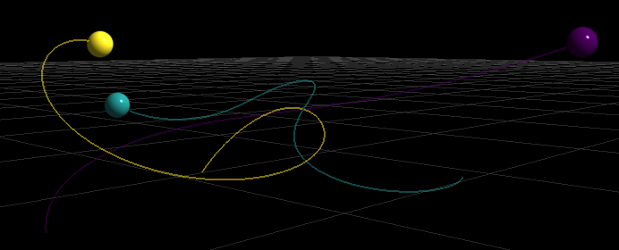
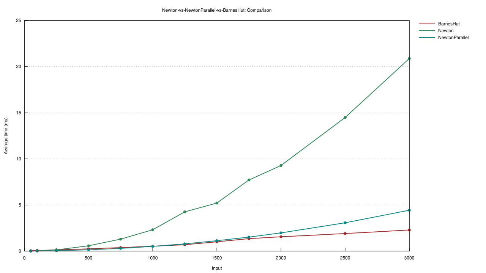
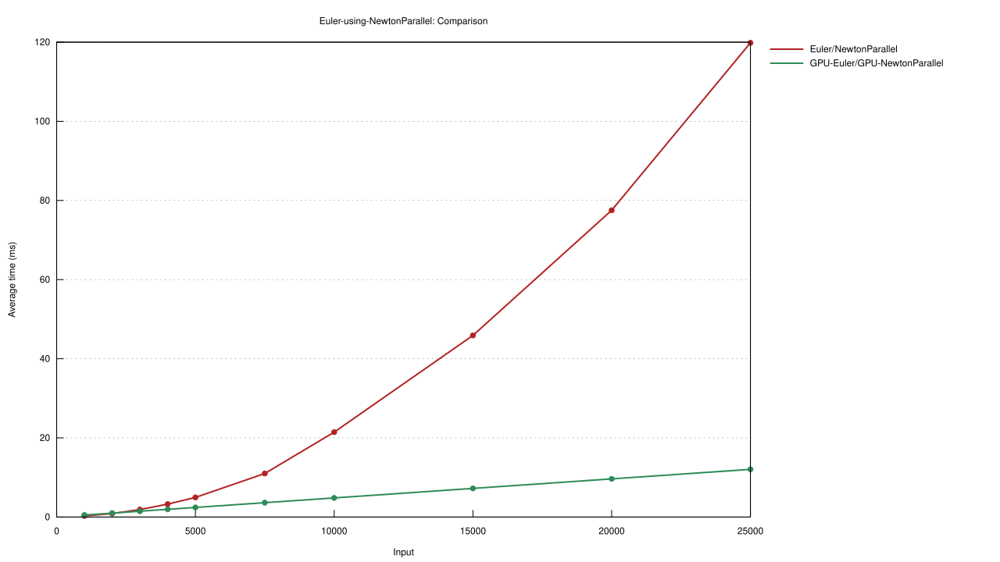
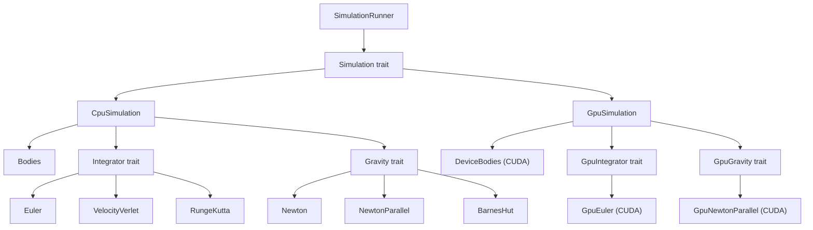
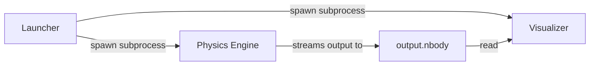

# n-body-sim
A simulator for how multiple objects in space (bodies) move and interact with each other through gravity.



## Overview
This project implements an N-body simulator that models the gravitational interactions between bodies in 3D using various numerical integration methods and algorithms. The physics engine is written in Rust, and the GUI is implemented in Python using the Qt framework and VisPy.

### Sections
- [Quick Start](#quick-start)
- [GUI Usage](#gui-usage)
  - [Launcher](#launcher)
  - [Visualizer](#visualizer)
- [CLI Usage](#cli-usage)
- [Data Formats](#data-formats)
  - [Initial Conditions](#initial-conditions)
  - [Output Data](#output-data)
- [Build](#build)
- [Architecture](#architecture)
- [Theory](#theory)
- [Benchmarks](#benchmarks)
- [License](#license)

## Quick Start
### Prerequisites
- Python 3.11+ installed
- (optional) NVIDIA GPU with CUDA 12.0+ support (already included in modern drivers) to use GPU acceleration

### Windows Setup
1. Download the latest release for Windows from the [releases page](https://github.com/luke-landry/n-body-sim/releases) and extract the zip file
2. Run `install.bat` to setup the Python virtual environment and install required packages (first time only)
3. Run `run.bat` to start the application

### Linux Setup
1. Download the latest release for Linux from the [releases page](https://github.com/luke-landry/n-body-sim/releases) and extract the tar.gz file
2. Run `install.sh` to setup the Python virtual environment and install required packages (first time only)
    - On Debian/Ubuntu, you may need to install `python3-venv` with `sudo apt install python3-venv` before running this install script
3. Run `run.sh` to start the application

### Run an Example Simulation
1. Start the application using the instructions above
2. Click "Load Scenario" and select an example initial conditions file (e.g. `data/examples/figure-eight/initial_conditions.csv`)
3. Click "Launch and View Simulation" to run the simulation and see the results.
4. In the visualizer window, press the "Play" button in the bottom left to start the simulation playback.
5. Use the WASD, QE, and FC keys to move and left-click mouse-drag to look around
6. You can close the visualizer window at any time and go back to the launcher to load a different configuration or run a new simulation. The launcher stays open while the visualizer is running, so you can launch multiple simulations and have multiple visualizer windows open at the same time.

### Generate a Random Simulation
1. Start the application using the instructions above
2. Under the "Generate Scenario" section, select a generator type (e.g. "Star System"), number of bodies `n` (e.g. 100), and radius `r` (e.g. 10.0), then click "Generate Scenario" to create a random initial conditions configuration
3. Click "Launch and View Simulation" to run the simulation and see the results.  
**Note:** disable the "Enable Trails" option in the visualization configuration for better performance when viewing 100+ bodies, as rendering trails for many bodies can cause lag during playback.

> [!WARNING]
> Simulations with large numbers of bodies (e.g. 1000+) can create very large output files (multiple GBs). These files are saved by default to `data/run/run_<timestamp>`, so make sure to have enough disk space and to clean up old runs if needed.

See the [GUI Usage](#gui-usage) and [CLI Usage](#cli-usage) sections below for more details on how to use the application.

## GUI Usage

### Launcher
The launcher allows you to configure simulation parameters and body initial conditions:
- **Simulation Parameters**: Set the various simulation parameters:
  - Gravitational constant 
  - Time step
  - Number of steps
  - Softening factor
  - Theta (for Barnes-Hut)
  - Gravity calculation method (if $N$ is the number of bodies in the simulation, it is recommended to use `newton` for $N\lt 100$, `newton-parallel` for $100 \leq N\lt 500$, and `barnes_hut` for $N\geq 500$.)
  - Integration method (the `runge-kutta` integrator takes the longest to compute, `velocity-verlet` is approximately twice as fast as `runge-kutta`, and `euler` is approximately twice as fast as `velocity-verlet`, so 4x faster than `runge-kutta`, but is the least accurate of the three)
- **Visualization Configuration**: Configure visualization and graphics settings
  - Camera mode (fly or turntable)
  - Step rate (playback speed in steps/second)
  - Default radius of bodies in visualization
  - Trail window size (length in previous time steps of trails behind each body)
  - Enable trails showing the recent path of each body ***(recommend disabling when viewing simulations with 100+ bodies to avoid lag during playback)***
  - Enable legend
  - Enable spherical visual effect for bodies (when disabled, bodies are rendered as flat colored circles)
- **Body Table**: Add, remove, and edit body properties (name, color, radius, mass, position, velocity)
- **Load/Save Scenario**: Load existing launcher configurations or save your current one
- **Generate Scenario**: Generate a random N-body system based on the selected generator (e.g. Star System), number of bodies (n) and radius (r).
- **Launch and View Simulation**: Start the physics simulation with your configured parameters and automatically display the visualization when complete
- **Launch Simulation**: Run the physics simulation without displaying the visualization. Prompts you to select a directory to save the results
- **View Simulation**: Load and display the visualization of previously saved simulation results from a selected directory

**Note:** The launcher expects these specific file names in selected directories when loading or saving configurations and simulation data:
- `initial_conditions.csv` for body initial conditions
- `config.json` for launcher configuration
- `output.csv` or `output.nbody` for simulation output data

When using the "Launch and View Simulation" option, the launcher automatically saves the initial conditions (`initial_conditions.csv`), the configuration (`config.json`), and the output data (`output.csv` or `output.nbody`) files to the directory `data/run/run_<timestamp>`. Otherwise, when using the individual "Launch Simulation" or "View Simulation" options, you will be prompted to select a directory to save or load these files, respectively.

### Visualizer

#### **Camera Navigation**
The visualizer supports two camera modes:

**Fly Mode** (free-flying camera):
- **Look**: Left-click and drag to look around
- **Movement**: Use WASD to move around, Q and E to roll, and F and C to move up and down
- **Zoom**: Scroll wheel to zoom in/out

**Turntable Mode** (orbit around center):
- **Rotate**: Left-click and drag to orbit around the center
- **Translate**: Shift-left-click and drag to translate the camera
- **Zoom**: Scroll wheel to zoom in/out

#### **Playback Controls**
- **Play/Pause**: Click the "Play" button to start/stop the simulation playback
- **Timeline**: Click and drag on the slider or click at any point to jump to a specific time step in the simulation

## CLI Usage
The Rust physics engine executable can also be run independently without installing Python or using the GUI tools.

### Command Line Options

**General Usage**
- `-i, --initial-conditions-path`: Path to a CSV file containing the initial conditions for each body in the simulation. Each row should represent a body with its mass, initial position, and initial velocity. Default: `initial_conditions.csv`
- `-o, --output-data-path`: Path to a csv or nbody file where the simulation output data will be saved. Default: `output.nbody`
- `-g, --g-constant`: The gravitational constant to use in the gravitational force calculations. This is a scaling factor that affects the strength of the gravitational interactions between bodies. Default: `1.0`
- `-t, --time-step`: The time step in seconds for the simulation. This determines how frequently the positions and velocities of the bodies are updated. A smaller time step can lead to more accurate results but will increase the computation time. Default: `0.01`
- `-n, --num-steps`: The total number of time steps to simulate. This determines the overall duration of the simulation. For example, with a time step of 0.01 seconds and 10000 steps, the simulation will cover a total of 100 seconds of simulated time. Default: `10000`
- `--softening-factor`: The softening factor is used to prevent numerical instability when two bodies come very close to each other. It is added to the distance between bodies in the force calculation to ensure that the force does not become infinite. A larger softening factor increases numerical stability but reduces physical accuracy at short distances, while a smaller softening factor provides higher physical accuracy but increases the risk of instability during close encounters. Default: `0.005`
- `--theta`: The theta value is used in the Barnes-Hut gravity calculation method to determine when to approximate a group of distant bodies as a single combined mass. A smaller theta value results in a more accurate simulation but increases computation time, while a larger theta value reduces accuracy but improves performance. Default: `0.5`
- `--gravity`: The method to use for calculating gravitational forces between bodies. The options are `newton`, `newton-parallel`, and `barnes-hut`. Default: `newton`
- `--integrator`: The numerical integration method to use for updating the positions and velocities of the bodies at each time step. The options are `euler`, `velocity-verlet`, and `runge-kutta`. Default: `euler`
- `--gpu`: Enable GPU acceleration for the simulation using CUDA. This can significantly improve performance for large simulations, but requires an NVIDIA GPU with CUDA support. Currently only supports the `newton-parallel` gravity method and `euler` integrator. Default: disabled
- `-h --help`: Displays the help message with all available command line options

### Examples

**Windows:**
```
bin\n-body-sim.exe -i data/examples/figure-eight/initial_conditions.csv -o data/output.csv --time-step 0.01 --num-steps 10000 --integrator velocity-verlet
```

**Linux:**
```
bin/n-body-sim -i data/examples/figure-eight/initial_conditions.csv -o data/output.csv --time-step 0.01 --num-steps 10000 --integrator velocity-verlet
```

## Data Formats

### Initial Conditions
Initial conditions are provided as a CSV file with each row corresponding to a body:
| Column  | Type  | Description        |
| ------- | ----- | ------------------ |
| `mass`  | float | Body mass          |
| `pos_x` | float | Initial x-position |
| `pos_y` | float | Initial y-position |
| `pos_z` | float | Initial z-position |
| `vel_x` | float | Initial x-velocity |
| `vel_y` | float | Initial y-velocity |
| `vel_z` | float | Initial z-velocity |

**Example**
```csv
mass,pos_x,pos_y,pos_z,vel_x,vel_y,vel_z
1,0,0,0,0,0,0
3.003e-6,1,0,0,0,1,0
3.694e-8,1.00257,0,0,0,1.0342,0
```

### Output Data

#### **CSV**

Output can be saved to a CSV file with time series data for all bodies:
| Column | Type  | Description           |
| ------ | ----- | ----------------------|
| `time` | float | Timestamp             |
| `id`   | int   | Body identifier       |
| `x`    | float | Current x-position    |
| `y`    | float | Current y-position    |
| `z`    | float | Current z-position    |

The body ID matches the order of the bodies in the initial conditions, so the first body is ID 0, the second is ID 1, and so on.

**Example**
```csv
time,id,x,y,z
0.0,0,-1.0,0.0,0.0
0.0,1,1.0,0.2,0.0
0.0,2,0.0,1.0,-0.2
0.01,0,-0.9999410506357825,0.005036782899891881,0.0019931360081177473
0.01,1,0.9969294480041954,0.1950342751323182,-9.184518199699633e-6
0.01,2,0.002011602631587234,0.9999289419677899,-0.19498395148991807
...
```

#### **Binary**

For more efficient file sizes, especially for large simulations, output can be saved to a binary file format:

| **Field** | **Type** | **Size (Bytes)** | **Description**                             |
| --------- | -------- | ---------------- | --------------------------------------------|
| `time`    | `f64`    | 8                | Timestamp                                   |
| `id`      | `u64`    | 8                | Body identifier                             |
| `x`       | `f64`    | 8                | The x-coordinate of the body's position.    |
| `y`       | `f64`    | 8                | The y-coordinate of the body's position.    |
| `z`       | `f64`    | 8                | The z-coordinate of the body's position.    |

The file extension for binary output data files is `.nbody` and the file begins with an 8-byte magic number: `0x4E424F4459303031` (ASCII `NBODY001`). Each record consists of the five 64-bit (little-endian 8-byte) fields: time, id, and the x, y, z coordinates of the body's position at that time step, for a total of 40 bytes per record.
```
[0x4E424F4459303031][time][id][x][y][z][time][id][x][y][z]...
```

## Build

### Container Setup
#### **Using Dev Containers**
1. Launch the project in a dev container from your code editor using the configuration in `.devcontainer/devcontainer.json`

#### **Manually with Docker installed**
1. Build the development image with `docker build -t n-body-sim .`
2. If an existing n-body-sim container is running, stop it with `docker rm -f n-body-sim`
3. Run the development container with 
    - Linux (bash): `docker run -dit -v $(pwd):/home/dev/n-body-sim --name n-body-sim n-body-sim`
    - Windows (PS): `docker run -dit -v ${PWD}:/home/dev/n-body-sim --name n-body-sim n-body-sim`
4. Enter the container with `docker exec -it n-body-sim bash`


### Targets
  - Linux: `cargo build --release`
  - Windows: `cargo build --release --target x86_64-pc-windows-gnu`

### Install
The Rust executable will be built to `target/release/n-body-sim` for Linux target and `target/x86_64-pc-windows-gnu/release/n-body-sim.exe` for Windows target. The Python GUI expects the Rust executable to be located at `bin/n-body-sim` for Linux and `bin\n-body-sim.exe` for Windows, so copy the built executable to those paths after building.
```bash
cp target/release/n-body-sim bin/n-body-sim # Linux
```
```powershell
cp target\x86_64-pc-windows-gnu\release\n-body-sim.exe bin\n-body-sim.exe # Windows
```

Make sure to exit the container to run the Python GUI, as the container is only meant for building the Rust executable, and the Python GUI is run on the host machine.

### Release
Release build archives can be created using the `scripts/release.sh` script, which builds the Rust executable for both Linux and Windows targets and copies them along with other necessary files to the `dist` directory, then creates zip and tar.gz archives for each target in the `dist` directory.


## Theory

The **N-body problem** involves predicting the motions of objects interacting through gravitational force. For 3+ bodies there is no closed-form solution, so the system must be integrated numerically in small time steps, and generally becomes chaotic (highly sensitive to initial conditions).

**Integrators** update body positions and velocities each step:
- **Semi-implicit Euler**: first-order symplectic; fastest, least accurate
- **Velocity Verlet**: second-order symplectic; ~2× slower than Euler, better long-term energy conservation
- **Runge-Kutta (RK4)**: non-symplectic; ~4× slower than Euler, highest short-term accuracy

**Gravity methods** compute forces between bodies:
- **Newton**: exact $O(n^2)$, single-threaded; fastest for $n \lt 100$
- **Newton Parallel**: exact $O(n^2)$, multi-threaded; fastest for $100 \leq n \lt 1000$
- **Barnes-Hut**: approximate $O(n\ log\ n)$ octree; fastest for $n \geq 1000$

See [docs/theory.md](docs/theory.md) for full derivations, the symplectic vs non-symplectic tradeoff, the Barnes-Hut approximation criterion, and the softening factor.

## Benchmarks

Benchmarks use the [criterion](https://github.com/bheisler/criterion.rs) crate (`cargo bench`). Key results on an Intel i5-12450H (8C/12T):
- Euler → Velocity Verlet → RK4 step times scale ~1:2:4, dominated by the number of gravity evaluations per step
- Newton Parallel outperforms single-threaded Newton for $n \geq 100$; Barnes-Hut outperforms Newton Parallel for $n \geq 1000$



GPU acceleration (NVIDIA A100, FP64) outperforms CPU Newton Parallel for $n \geq 2000$, with near-linear apparent scaling due to massive parallelism:



See [docs/benchmarks.md](docs/benchmarks.md) for full results including integrator comparisons, Barnes-Hut theta sensitivity, and an RTX 5090 vs A100 GPU comparison.

## Architecture

The project has two components: a **Rust physics engine** (`src/`) and a **Python GUI** (`gui/`).

### Physics Engine

The physics engine is structured to be modular and extensible, using traits to allow simulations across various configurations of gravity methods, integrators, and CPU vs GPU execution.


```mermaid
graph TD
    SR[SimulationRunner] --> SIM["Simulation trait"]

    SIM --> CPU[CpuSimulation]
    SIM --> GPU[GpuSimulation]

    CPU --> B["Bodies"]
    CPU --> INT["Integrator trait"]
    CPU --> GRAV["Gravity trait"]
    INT --> EU[Euler] & VV[VelocityVerlet] & RK[RungeKutta]
    GRAV --> N[Newton] & NP[NewtonParallel] & BH[BarnesHut]

    GPU --> DB["DeviceBodies (CUDA)"]
    GPU --> GINT["GpuIntegrator trait"]
    GPU --> GGRAV["GpuGravity trait"]
    GINT --> GEU["GpuEuler (CUDA)"]
    GGRAV --> GNP["GpuNewtonParallel (CUDA)"]
```

The `SimulationRunner` drives a `Simulation` implementation, which can be either a `CpuSimulation` or `GpuSimulation`. The `CpuSimulation` uses regular CPU implementations of the `Bodies`, `Integrator`, and `Gravity` traits, while the `GpuSimulation` uses `DeviceBodies` and GPU-specific traits for integrators and gravity methods.

### GUI Execution Flow


```mermaid
graph LR
    L["Launcher"] -->|"spawn subprocess"| E["Physics Engine"]
    E -->|"streams output to"| F["output.nbody"]
    L -->|"spawn subprocess"| V["Visualizer"]
    F -->|read| V
```

The Python UI launches the physics engine and visualizer as separate subprocesses. The physics engine writes output data to a file (`output.nbody`), which the visualizer loads and renders.

See [docs/architecture.md](docs/architecture.md) for detailed design notes on AoS vs SoA, GPU memory management, the CUDA/PTX build pipeline, and the Python subprocess design decisions.

## License
This project is licensed under the MIT License. See the [LICENSE](LICENSE) file for details.
