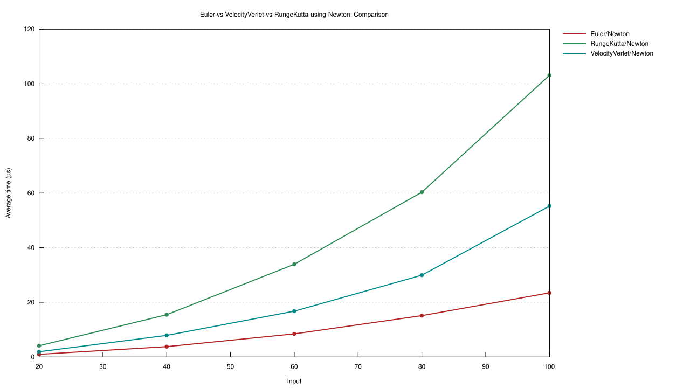
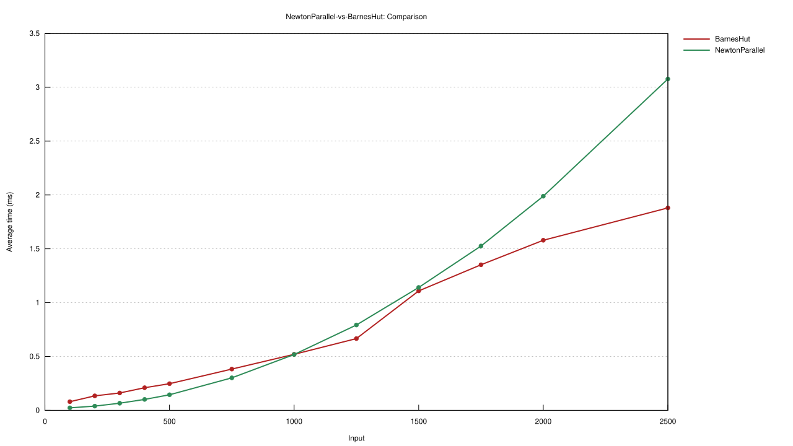
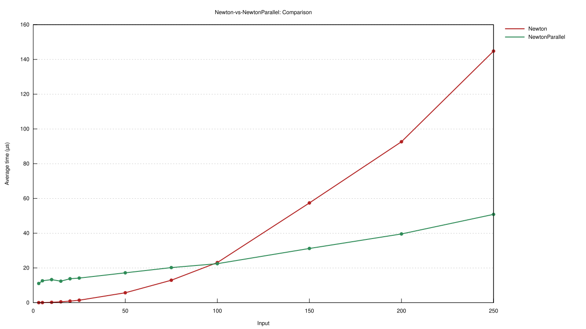
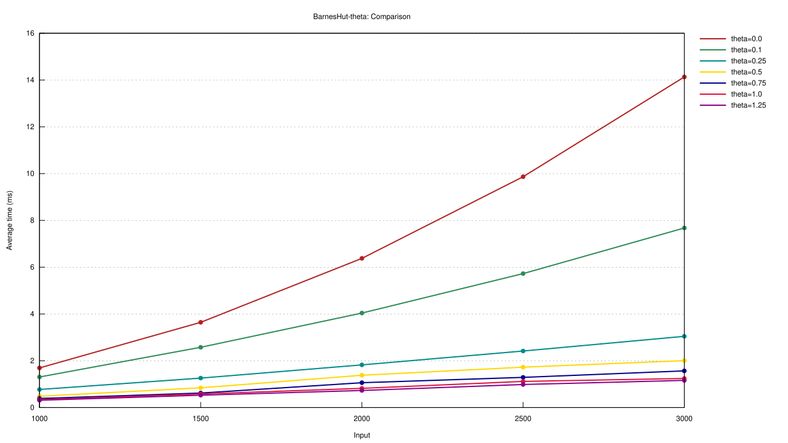
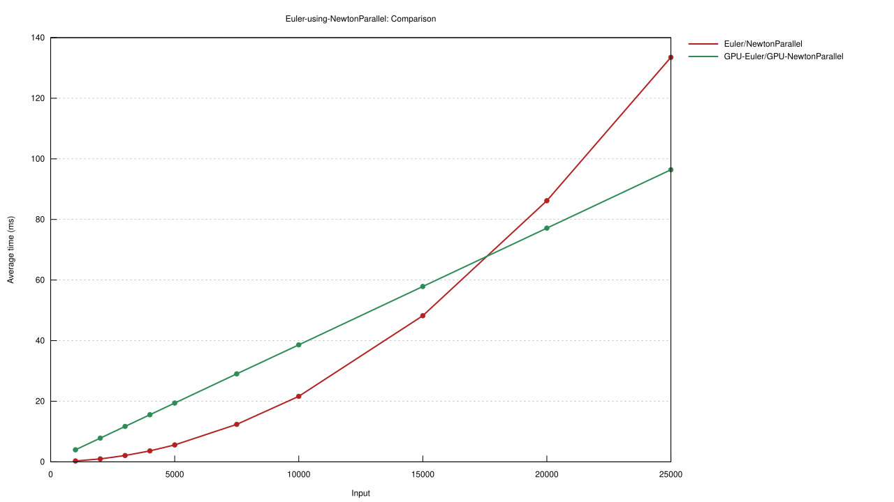

# Benchmarks

This project uses the `criterion` crate for benchmarking the physics engine. The benchmarks can be run using `cargo bench` and the results will be saved to the `target/criterion` directory as HTML reports which include automatically-generated graphs. To benchmark the gravity methods only, use `cargo bench --bench gravity_bench`, and to benchmark the integrators only, use `cargo bench --bench integrator_bench`. To configure the gravity methods, integrator methods, and n-values used in the benchmarks, edit the `gravity_bench.rs` and `integrator_bench.rs` files in the `benches` directory.

The benchmarks for GPU accelerated gravity and integrator methods are implemented in the `gpu_gravity_bench.rs` and `gpu_integrator_bench.rs` files. To run these benchmarks specifically, use `cargo bench --bench gpu_gravity_bench` and `cargo bench --bench gpu_integrator_bench`.

**Note:** criterion tries to use `gnuplot` by default to generate graphs for the benchmark reports, so you may want to install it on your system. Otherwise, it uses the `plotters` crate to generate graphs.

The following benchmarks for integrators and gravity methods were done on a mini-PC with an Intel Core i5-12450H (8C/12T, up to 4.4GHz) CPU and 32GB of DDR4 3200MHz RAM running Ubuntu Server 24.04.

## Integrators

This benchmark compares the three integrators: Euler, Velocity-Verlet, and Runge-Kutta using the same gravity method (Newton) across different numbers of bodies. The x-axis represents the number of bodies, and the y axis is time to compute a single step of the simulation.

This shows that the Euler integrator is the fastest, followed by Velocity-Verlet which is approximately 2x slower than Euler, and then Runge-Kutta which is approximately 4x slower than Euler. This is because Euler, Velocity Verlet, and Runge-Kutta perform 1, 2, and 4, acceleration calculations per step, respectively. So, given the same same gravity methods, the time difference between the integrators is a relatively consistent factor of 1x, 2x, or 4x for Euler, Velocity-Verlet, or Runge-Kutta, as the acceleration calculations dominate the overall computation time. The Euler method while being fast is the least accurate of the three, while the relatively slow Runge-Kutta is the most accurate, so there is a tradeoff between performance and accuracy when choosing an integrator.

## Gravity

These benchmarks compare the three gravity calculation methods: Newton, Newton Parallel, and Barnes-Hut across different numbers of bodies. The x-axis represents the number of bodies, and the y axis is time to compute a single set of accelerations for all bodies. For the Barnes-Hut method, an approximation threshold of $\theta=0.5$ was used.

These show that the single-threaded Newton method is the fastest for $n\lt 100$, while the multi-threaded Newton Parallel method becomes significantly faster than the single-threaded Newton method for $n\geq 100$, but still has a quadratic time complexity. The Barnes-Hut method has a better time complexity than the Newton methods, but much more initial overhead, so it is most efficient for large systems of $n\geq 1000$. Note that these exact n-value thresholds can vary based on the specific hardware that the benchmarks are run on, and especially the number of CPU cores available, which directly affects the performance of the multi-threaded Newton Parallel and Barnes-Hut methods. The performance of the Barnes-Hut method is also affected by the given approximation threshold $\theta$.

This next benchmark compares the Barnes-Hut method with different values of the approximation threshold $\theta$. The x-axis represents the number of bodies, and the y axis is time to compute a single set of accelerations for all bodies.

At $\theta=0.0$, the Barnes-Hut method never approximates distant bodies, so it has the same accuracy and time complexity of $O(n^2)$ as the Newton methods. At $\theta=0.1$, there is already a large performance improvement, and as $\theta$ increases, the performance continues to improve but with diminishing returns. Increasing $\theta$ decreases the time it takes to compute the accelerations, but also decreases the accuracy of the simulation results.

## GPU Acceleration

The following benchmarks compare the GPU-accelerated versions of the implemented GPU-accelerated gravity and integrator methods to their CPU counterparts across different numbers of bodies. The GPU-accelerated methods are implemented using CUDA and run on NVIDIA GPUs.

An important consideration with GPU acceleration is that this project uses FP64 (double precision) floating point numbers for the physics calculations to maintain higher accuracy during the simulation. In general, GPUs have much higher performance for FP32 (single precision) calculations compared to FP64. Also, most consumer-grade GPUs are optimized specifically for FP32 performance, so the difference in performance between FP32 and FP64 is even lower than the 1:2 ratio that would be expected based on the number of calculations alone. To get a direct 1:2 ratio, server-grade GPUs with better FP64 hardware support need to be used to make use of the full potential of GPU acceleration.

For example:
- **NVIDIA A100 (server-grade GPU)**: Theoretical FP32 performance is 19.49 TFLOPS, and theoretical FP64 performance is 9.746 TFLOPS, which is approximately a 1:2 ratio ([source](https://www.techpowerup.com/gpu-specs/a100-pcie-40-gb.c3623)).
- **NVIDIA RTX 5090 (consumer-grade GPU)**: Theoretical FP32 performance is 104.8 TFLOPS, but theoretical FP64 performance is only 1.637 TFLOPS, which is approximately a 1:64 ratio ([source](https://www.techpowerup.com/gpu-specs/geforce-rtx-5090.c4216)).

This benchmark was run on a cloud instance with an NVIDIA A100 PCIe 40GB GPU, with an AMD EPYC 7B13 CPU (32 allocated vCores) and 128GB of allocated RAM running Ubuntu Server 24.04 with CUDA 12.8.

The GPU-accelerated Euler/Newton Parallel method has a much higher initial overhead than the CPU version, so it is only faster after approximately $n\geq 2000$. However, for those larger numbers of bodies, the GPU-accelerated version is significantly faster than the CPU version, with the performance gap increasing as n increases. While the time complexity is still $O(n^2)$ for both versions, the GPU-accelerated version has a much lower constant factor due to the massive parallelism of the GPU, and at this scale the GPU's performance looks nearly $O(n)$ (linear).

This next benchmark was run on a cloud instance with an NVIDIA RTX 5090 PCIe 32GB GPU, with an AMD Ryzen Threadripper PRO 7975WX CPU (16 allocated vCores) and 96GB of allocated RAM running Ubuntu Server 24.04 with CUDA 12.8.

This shows the RTX 5090 has much lower FP64 performance compared to the A100, so the GPU-accelerated version is only faster than the CPU version after approximately $n\geq 18000$. However, as with the A100 benchmark, the performance gap continues to increase as n increases, and the GPU time still looks nearly $O(n)$ (linear) at this scale, but with a much higher constant factor than the A100.
